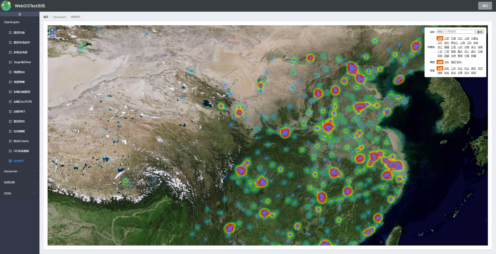
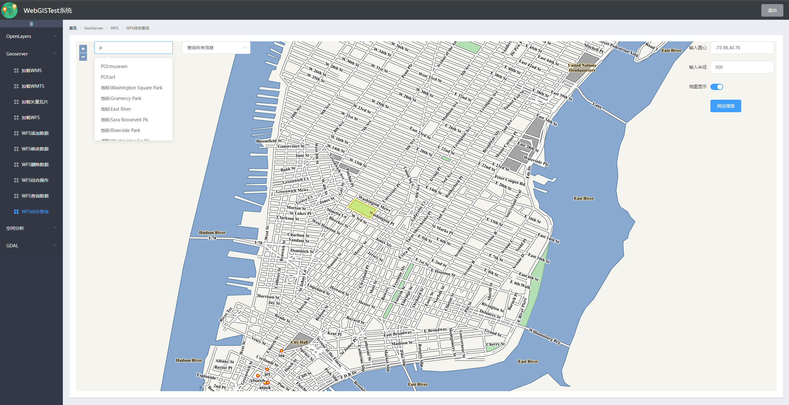
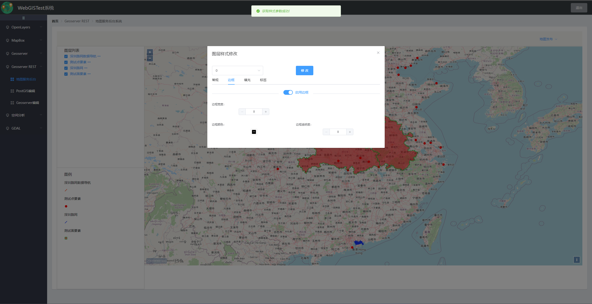

# WebGISTest-ui
前端项目

Vue | Element | Axios | OpenLayers | Mapbox-GL | Echarts

## 如何启动

### 安装依赖
```
npm install
```

### 测试环境启动项目
```
npm run serve
```

### 打包发布项目
```
npm run build
```

### 检测lint
```
npm run lint
```

### 注意端口号

本项目默认相关端口
```
后端端口号：28080
Geoserver端口号：28081
```
提示：在[.env.development](/vue-ui/.env.development)和[.env.production](/vue-ui/.env.production)修改后端接口和Geoserver服务端口

## 效果图

1. OpenLayer模块



2. Geoserver模块



3. 空间分析模块


4. GDAL模块



## 文档结构说明
```
├─image                                  图片资源
├─pages                                  项目打包文件
├─public                                 公共资源
│      favicon.ico
│      index.html
└─src                                    主目录
    ├─assets                                 资源                           
    │  ├─css                                    公共CSS样式
    │  └─image                                   图片资源
    ├─components                         页面组件
    │  │  Home.vue                          主页组件
    │  │  Login.vue                         登录组件
    │  │  Welcome.vue                       欢迎页组件
    │  │
    │  ├─analysis                        空间分析模块             
    │  │      BuffAnalysis.vue              缓冲区分析
    │  │      DiffAnalysis.vue              差异分析
    │  │      InterAnalysis.vue             叠加分析
    │  │      NetAnalysis.vue               网络分析
    │  │      SpaceRelation.vue             空间关系计算
    │  │      SymDiffAnalysis.vue           Sym分析
    │  │      UnionAnalysis.vue             合并分析      
    │  │
    │  ├─gdal                           GDAL模块
    │  │      ReadGdb.vue                   读取gdb数据
    │  │
    │  ├─geoserver                      Geoserver模块
    │  │  │  VectorTiles.vue                加载矢量切片
    │  │  │  WMS.vue                        加载WMS
    │  │  │  WMTS.vue                       加载WMTS
    │  │  └─wfs                           WFS模块
    │  │          AddWFS.vue                WFS添加数据
    │  │          AllQueryWFS.vue           WFS综合查询
    │  │          AllWFS.vue                WFS综合操作
    │  │          DeleteWFS.vue             WFS删除数据
    │  │          QueryWFS.vue              WFS查询数据
    │  │          UpdateWFS.vue             WFS更新数据
    │  │          WFS.vue                   加载WFS
    │  │
    │  └─openlayers                     OpenLayer模块
    │          ClickHighlight.vue           点击高亮
    │          ClikLatLon.vue               显示经纬度
    │          LayerCheckBox.vue            图层多选空间
    │          LayerEcharts.vue             结合Echarts
    │          LayerEdit.vue                图层在线编辑
    │          LayerLink.vue                图层联动
    │          LayerSwitch.vue              图层切换
    │          PostPoint.vue                请求后端数据并显示
    │          ShowCollege.vue              高校综合例子
    │          ShowGeoJSON.vue              加载GeoJSON
    │          ShowPopup.vue                显示地图弹窗
    │          ShowWKT.vue                  加载WKT
    │          TargetView.vue               Target和View
    │          WebGISUI.vue                 WebGIS页面结构
    │
    ├─plugins                         插件
    │      element.js                    element按需导入
    ├─router                          路由
    │      index.js                      所有页面跳转路由
    ├─utils                           工具类
    │      searchUtils.js                图层查询工具类
    │  App.vue                        页面主入口
    │  main-dev.js                    测试环境js
    └  main-prod.js                   开发环境js
│  .env.development                测试环境变量配置
│  .env.production                 发布环境变量测试
└  vue.config.js                   测试和发布环境配置文件
```
